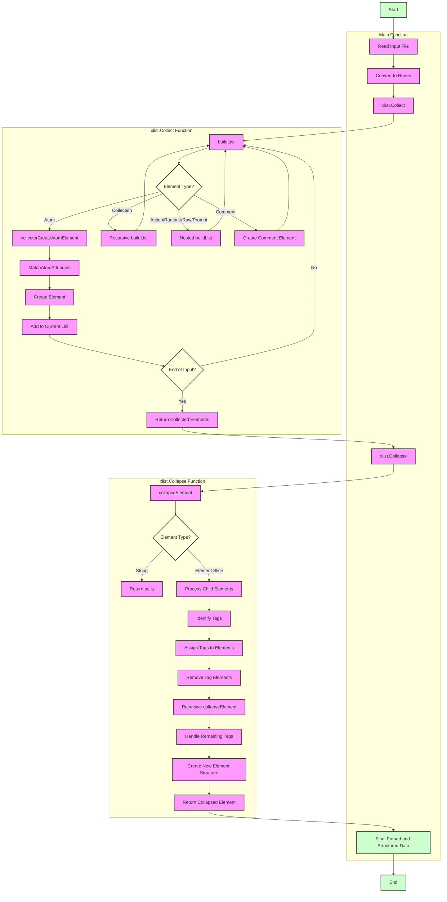

```mermaid
graph TD
    A[Start] --> B[Read Input File]
    B --> C[Convert to Runes]
    C --> D[xlist.Collect]
    D --> E[buildList]
    E --> F{Element Type?}
    F -->|Atom| G[collectorCreateAtomElement]
    F -->|Collection| H[Recursive buildList]
    F -->|Action/Runtime/Raw/Prompt| I[Nested buildList]
    F -->|Comment| J[Create Comment Element]
    G --> K[MatchAtomAttributes]
    H --> E
    I --> E
    J --> E
    K --> L[Create Element]
    L --> M[Add to Current List]
    M --> N{End of Input?}
    N -->|No| E
    N -->|Yes| O[Return Collected Elements]
    O --> P[xlist.Collapse]
    P --> Q[collapseElement]
    Q --> R{Element Type?}
    R -->|String| S[Return as is]
    R -->|Element Slice| T[Process Child Elements]
    T --> U[Identify Tags]
    U --> V[Assign Tags to Elements]
    V --> W[Remove Tag Elements]
    W --> X[Recursive collapseElement]
    X --> Y[Handle Remaining Tags]
    Y --> Z[Create New Element Structure]
    Z --> AA[Return Collapsed Element]
    AA --> AB[Final Parsed and Structured Data]
    AB --> AC[End]

    subgraph "Main Function"
        B
        C
        D
        P
        AB
    end

    subgraph "xlist.Collect Function"
        E
        F
        G
        H
        I
        J
        K
        L
        M
        N
        O
    end

    subgraph "xlist.Collapse Function"
        Q
        R
        S
        T
        U
        V
        W
        X
        Y
        Z
        AA
    end

    classDef process fill:#f9f,stroke:#333,stroke-width:2px;
    classDef decision fill:#ffd,stroke:#333,stroke-width:2px;
    classDef data fill:#cfc,stroke:#333,stroke-width:2px;
    class B,C,D,E,G,H,I,J,K,L,M,O,P,Q,S,T,U,V,W,X,Y,Z,AA process;
    class F,N,R decision;
    class A,AB,AC data;
```